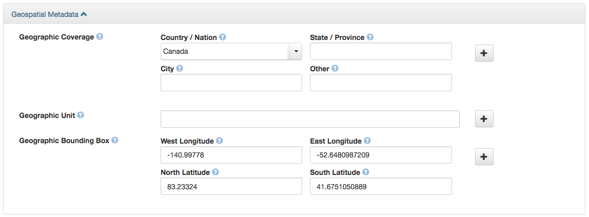

## Geodisy: A guide for researchers depositing data in Dataverse

_Interested in increasing the discoverability of your data? Geodisy offers an exciting way to expose location-based research to a broad audience._

Access Geodisy here: <https://geo.frdr-dfdr.ca/>

### What is Geodisy?

Geodisy is an open source discovery tool that allows users to find open data from Canadian researchers visually, spatially and quickly.

Research data can be hard to find, and even harder when looking for data about a specific area or place. Geodisy changes that, giving users a window into the world of research data with map-based tools familiar to everyone. Users can search by place name or using an interactive map. The Geodisy search interface will be available on Canada’s Federated Research Data Repository website (<https://geo.frdr-dfdr.ca>) and is accessible to the public. Data from institutions across Canada make up the source collection for Geodisy – making your data discoverable alongside other rich content deposited by researchers from across Canada.

### Is Geodisy for me?

If your research data can be shared openly and is tied to a location on Earth, then Geodisy is for you! Geodisy is not limited to traditional geospatial data – it can generate coordinates for most datasets associated with a terrestrial location. Coordinates from both data and metadata are used to map each dataset by its location. This makes Geodisy a powerful tool for many different subject areas.

Geodisy is specifically designed to provide discovery for data with Earth-based geographical features. Datasets with no geographical features or those that represent non-terrestrial locations can be discovered elsewhere (e.g. through FRDR’s main search) but will be excluded from Geodisy.

How to deposit your data in Dataverse to ensure data is visible to Geodisy
For data to appear in Geodisy, the software must be able to determine its geographic extent and generate a bounding box (a series of four geographic coordinates representing the corners of a box) using the metadata provided by you, the depositor. 

>**What is a bounding box?**
>A bounding box is a rectangle on the earth defined by the northern, southern, eastern and western extents of an area. In Dataverse, bounding boxes are added as coordinates in decimal degrees — eg: 49.23138 degrees north. Do not use other units (such as metres, feet, etc.) even if your geospatial data is projected using those units, and do not include the degree symbol.

### How to include the appropriate metadata:
The Dataverse Geospatial Metadata section in Dataverse:  

Making your data appear in Geodisy’s spatial search does not require much extra work. Use these four steps to ensure your data is suitable for inclusion:
1. Once your dataset has been deposited, access the record, click on the “Metadata” tab, and select “Add + Edit Metadata”
2. Scroll past the Citation Metadata and expand the Geospatial Metadata block
3. Does your data include coordinates? If so, enter them in the Geographic Bounding Box fields. If you have multiple files, you should enter a bounding box or boxes that **best represent your data**
4. If your data does not include coordinates (or you don’t know what they are) but is associated with one or more locations, don’t worry! Geodisy can use this information to generate a bounding box. Fill out the Geographic Coverage fields using one of the following combinations:
* Country/Nation
* Country/Nation AND State/Province
* Country/Nation AND State/Province AND City
The “Other” field is optional but should be used for geographical names that are not a country, state/province, or city, e.g. continents, regions, water bodies, parks, etc.

>**Global or near-global geographical coverage**
>It is important that bounding box metadata to be as accurate as possible for optimal spatial searching, even if the area covered is very large. For example, you may choose to enter multiple continents or oceans in the “Other” field. However, if you feel your data is best or most practically represented by a bounding box covering the entire globe, enter these coordinates:  
>West Longitude: -180  
>East Longitude: 180  
>North Latitude: 90  
>South Latitude: -90  

This process allows even non-geospatial data to be displayed in Geodisy. For example, a survey that takes place in Calgary, Alberta can still be discovered if the appropriate metadata blocks (as per step 4) are filled out, even if the raw survey data itself doesn’t contain explicitly geospatial data. This means a Geodisy user can look at Calgary on the Geodisy map, see that a survey was conducted there, and be taken to the data.

If you’re depositing geospatial data (such as a Shapefile, GeoTIFF, geoJSON, etc.), Geodisy will generate records and previews for each item included in your data set. For example, if your data contains three Shapefiles, Geodisy will preview each shapefile separately, with a note indicating each one has been deposited with partner Shapefiles (File 1/3, File 2/3, etc.) 

[The Dataverse North Geospatial Guide](https://dx.doi.org/10.14288/1.0388724) provides more information on best practices for using Dataverse’s Geospatial Metadata block. 

## Geodisy for institutions
If you’ve come across this guide and you would like your institution to implement a Geodisy connection, please see [Geodisy: Implementing a Dataverse connection at your institution](https://github.com/ubc-library/geodisy/blob/master/Documentation/userguides/GeodisyInstitutionalGuide.md).

**Questions?** Contact the Geodisy team at [geodisy.info@ubc.ca](mailto:geodisy.info@ubc.ca)
