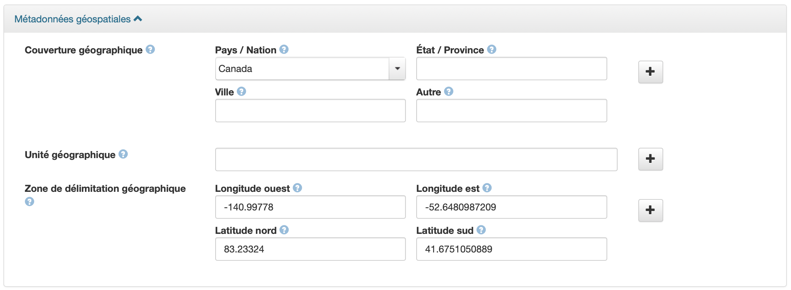

## Geodisy : Un guide à l’intention des chercheurs déposant des données dans Dataverse

_Vous souhaitez accroître la possibilité de découvrir vos données ? Geodisy offre un moyen intéressant de faire connaître la recherche par localisation à un large public._

Pour accéder à Geodisy : https://geo.frdr-dfdr.ca/fr

### En quoi consiste Geodisy ?

Geodisy est un outil de découverte à source ouverte qui permet aux utilisateurs de trouver les données ouvertes des chercheurs canadiens de manière visuelle, spatiale et rapide.

Les données de recherche peuvent être difficiles à trouver, surtout lorsqu’on cherche des données sur une région ou un endroit précis. Geodisy pallie cette difficulté en offrant aux utilisateurs une fenêtre sur le monde des données de recherche grâce à des outils cartographiques familiers. Les utilisateurs peuvent effectuer des recherches par nom de lieu ou à l’aide d’une carte interactive. L’interface de recherche Geodisy sera disponible sur le site web du Dépôt fédéré de données de recherche du Canada (https://geo.frdr-dfdr.ca/fr) et accessible au public. Les données provenant d’établissements de tout le Canada constituent la collection source de Geodisy, permettant la découverte de vos données ainsi que d’autres contenus riches déposés par des chercheurs du Canada.

### Geodisy me convient-il ?

Si vos données de recherche peuvent être partagées ouvertement et sont liées à un emplacement sur Terre, alors Geodisy est pour vous ! Geodisy ne se limite pas aux données géospatiales traditionnelles ; il peut générer des coordonnées pour la plupart des ensembles de données associés à un emplacement terrestre. Les coordonnées issues des données et des métadonnées servent à cartographier chaque ensemble de données en fonction de son emplacement. Ce qui fait de Geodisy un outil puissant pour divers domaines.

Geodisy est conçu spécialement pour permettre la découverte de données comportant des caractéristiques géographiques terrestres. Les ensembles de données sans caractéristiques géographiques ou ceux qui représentent des lieux non terrestres peuvent être découverts ailleurs (par exemple à partir de la recherche principale du DFDR), mais seront exclus de Geodisy.

Comment déposer vos données dans Dataverse pour que les données soient relevées par Geodisy ? Pour que les données apparaissent dans Geodisy, le logiciel doit être en mesure de déterminer leur étendue géographique et de générer un cadre englobant (soit une série de quatre coordonnées géographiques représentant les coins d’un cadre) à l’aide des métadonnées que vous fournissez en tant que déposant.

>**Qu’est-ce qu’un cadre englobant ?**
>Un cadre englobant est un rectangle sur la Terre défini par les coordonnées nord, sud, est et ouest d’une zone. Dans Dataverse, les cadres englobants sont ajoutés sous forme de coordonnées en degrés décimaux — par exemple : 49.23138 degrés nord. N’utilisez pas d’autres unités (telles que les mètres, les pieds, etc.) même si vos données géospatiales sont projetées à l’aide de ces unités et n’ajoutez pas le symbole de degré.

### Comment inclure les métadonnées appropriées :
La section des métadonnées géospatiales dans Dataverse :

Faire apparaître vos données dans la recherche géographique de Geodisy ne demande pas beaucoup de travail supplémentaire. Suivez les quatre étapes suivantes pour faire en sorte que vos données puissent être incluses :
1.	Une fois que votre ensemble de données a été déposé, cliquez l’onglet « Métadonnées » pour accéder à l’enregistrement et sélectionnez « Add + Edit Metadata ».
2.	Faites défiler le menu passé les métadonnées de citation et agrandissez le bloc de métadonnées géospatiales.
3.	Vos données comprennent-elles des coordonnées ? Le cas échéant, entrez-les dans les champs du cadre englobant géographique. Si vous avez plusieurs fichiers, vous devez saisir un cadre englobant ou plusieurs cadres englobants délimitant le mieux vos données.
4.	Si vos données ne comprennent pas de coordonnées (ou si vous ne savez pas ce qu’elles sont), mais elles sont associées à un lieu ou plusieurs lieux ; aucun souci ! Geodisy peut utiliser ces informations pour générer un cadre englobant. Remplissez les champs de couverture géographique avec l’une des combinaisons suivantes :
* Pays/Nation
* Pays/Nation ET État/Province
* Pays/Nation ET État/Province ET Ville.
Le champ « Autre » est facultatif, mais doit être utilisé pour les noms géographiques qui ne sont pas un pays, un état/province ou une ville, par exemple les continents, les régions, les plans d’eau, les parcs, etc..

>**Couverture géographique mondiale ou quasi mondiale.**
>Il est important que les métadonnées des cadres englobants soient aussi précises que possible pour une recherche spatiale optimale, même si la zone couverte est très vaste. Par exemple, vous pouvez choisir d’entrer plusieurs continents ou océans dans le champ « Autre ». Cependant, si vous pensez que vos données sont mieux délimitées ou représentées de manière plus pratique par un cadre englobant couvrant le monde entier, saisissez les coordonnées suivantes :
>Longitude Ouest : -180
>Longitude Est : 180
>Latitude Nord : 90
>Latitude Sud : -90

Ce processus permet même d’afficher des données non géospatiales dans Geodisy. Par exemple, un levé effectué à Calgary, en Alberta, peut toujours être découvert si les blocs de métadonnées appropriés (selon l’étape 4) sont remplis, même si les données brutes du levé lui-même ne contiennent pas explicitement de données géospatiales. Ainsi, un utilisateur de Geodisy peut regarder Calgary sur la carte Geodisy, voir qu’un levé y a été effectué et accéder aux données.

Si vous déposez des données géospatiales (telles qu’un Shapefile, GeoTIFF, geoJSON, etc.), Geodisy générera des enregistrements et des aperçus pour chaque élément inclus dans votre ensemble de données. Par exemple, si vos données contiennent trois fichiers Shapefile, Geodisy prévisualisera chaque fichier Shapefile séparément, avec une note indiquant que chacun a été déposé avec les fichiers Shapefile connexes (fichier 1/3, fichier 2/3, etc.).

[The Dataverse North Geospatial Guide](https://dx.doi.org/10.14288/1.0388724) fournit plus d’informations sur les meilleures pratiques pour l’utilisation des blocs de métadonnées géospatiales de Dataverse.

### Geodisy pour les établissements
Si vous avez découvert ce guide et souhaitez que votre établissement mette en place une connexion Geodisy, veuillez consulter [Geodisy : Mise en œuvre d’une connexion pour la découverte de données dans votre établissement](https://github.com/ubc-library/geodisy/blob/master/Documentation/userguides/GeodisyInstitutionalGuide-FR.md).

**Questions ?** Communiquer avec l’équipe Geodisy à [geodisy.info@ubc.ca](mailto:geodisy.info@ubc.ca)
